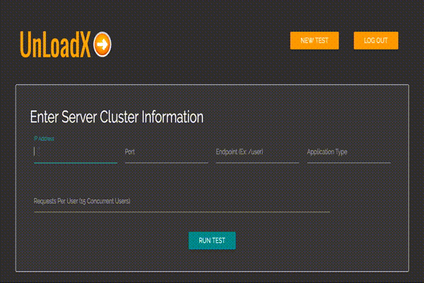
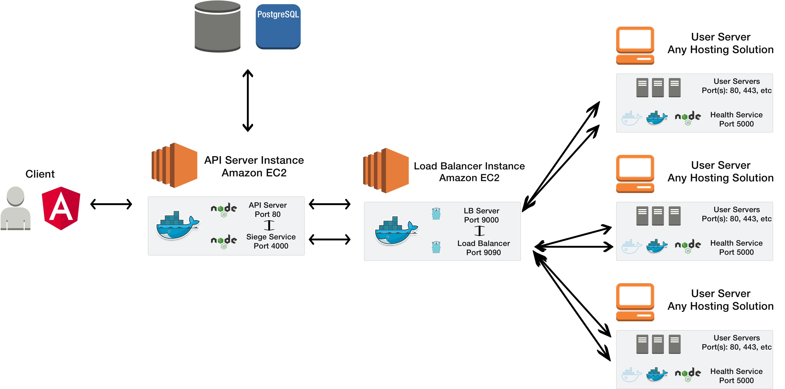

# UnLoadX - Load balancing and testing as a service
### Static file and API server
This repo contains the code for the server portion of UnLoadX; for the load balancer code go to [this repo](https://github.com/Unload-Labs/UnLoadX-LB)

   
## Table of Contents
1. Summary
2. Instructions
3. Team
4. Tech Stack
5. Contributing

## Summary
UnLoadX is a platform that provides users with the ability to deploy servers behind a dedicated load balancer within seconds. The application's health-based monitoring uses server CPU and memory to route traffic and is a more effective approach to load balancing than DNS round robin or connection-based strategies.  

UnLoadX offers a load testing service that can be used to simulate high traffic conditions. Users can enter a duration for the test and will receive request-level data back including latency, status code information, and CPU and health of each server in the test.   
   

## Instructions
### Running load tests
1. Navigate to www.unloadx.com.
2. Sign up or login with an existing account. When you create an account the system will assign a new load balancer instance to it.  During the time it takes to spin up a load balancer instance (typically no more than a minute or two) the button to run a load test will be disabled.
3. Enter IP and port combinations for your servers. You may optionally specify REST endpoints and descriptions for the application running on each IP and port.
4. On each of the servers you entered, install Docker and run `docker pull aeb0/healthservice && docker run -p 5000:5000 -d healthservice aeb0/healthservice npm start` This will run a Dockerized microservice on each machine that responds to GET requests to port 5000 with the server's memory and CPU.  UnLoadX will not initiate a load test to servers that do not have the service installed.
5. Enter the number of requests to be triggered per user during the test. By default the system uses 15 concurrent users in the test.
6. Click Run Test to start the test. You must be logged in to run a test, and new users will need to wait one to two minutes for their load balancer instance to become available.
7. On the results page, the Display Results button will become active once the test is over; click it to view results. 

## Team

  - __Product Owner__: [Andy Brown](https://github.com/aebrow4)
  - __Scrum Master__: [Tabitha Blagdon](https://github.com/tabithablagdon)
  - __Development Team Members__: [James Ramadan](https://github.com/jamesramadan)

## Tech Stack
* Angular 2
* NVD3
* Node.js & Express.js
* Go
* PostgreSQL
* Docker

## Contributing

### Requirements
- Node 6.3.0+
- NPM 3.10.3+
- PostgreSQL
- Docker
- Docker-compose
- Go

### Installing Dependencies
1. `git clone https://github.com/Unload-Labs/UnLoadX.git && cd UnLoadX`
2. `docker-compose up -d`
3. This repo contains code for the static file server, API server, and siege service. The load balancer code is in a [separate repo](https://github.com/Unload-Labs/UnLoadX-LB)
